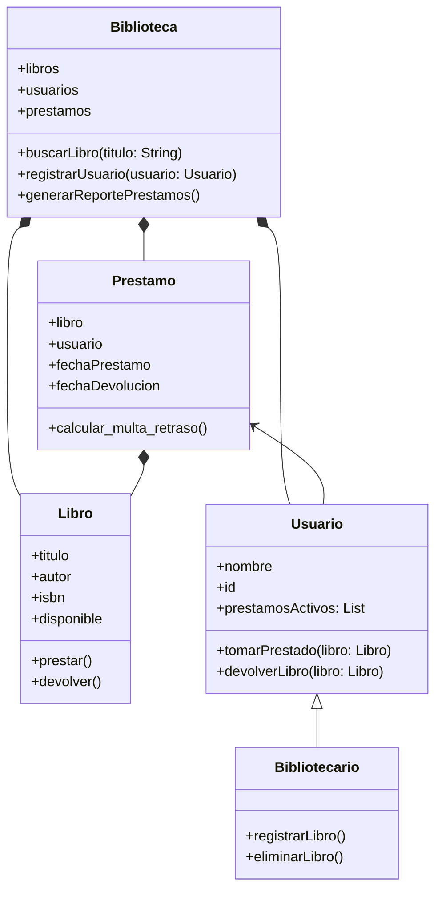

# Reto2_POO
>1.Elija un problema de la vida real (sistema de gestión de biblioteca, negocio de compra-venta, automóvil, etc) que se pueda modelar a través de objetos y clases. Plantee las relaciones de clases, composiciones, propiedades y comportamientos del sistema en uno mas diagramas tipo UML.

Se creo un sistema de gestion de biblioteca, la cual esta compuesta por: Libros, usuarios, prestamos. El bibliotecario hereda atributos del usuario y el usuario interactua con el prestamo.
